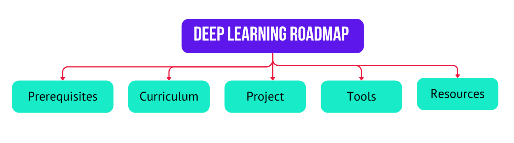
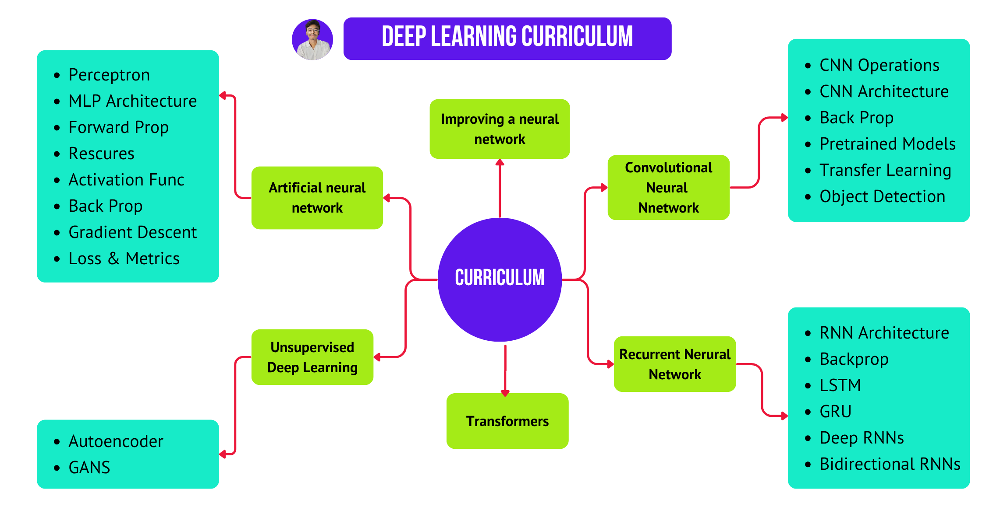
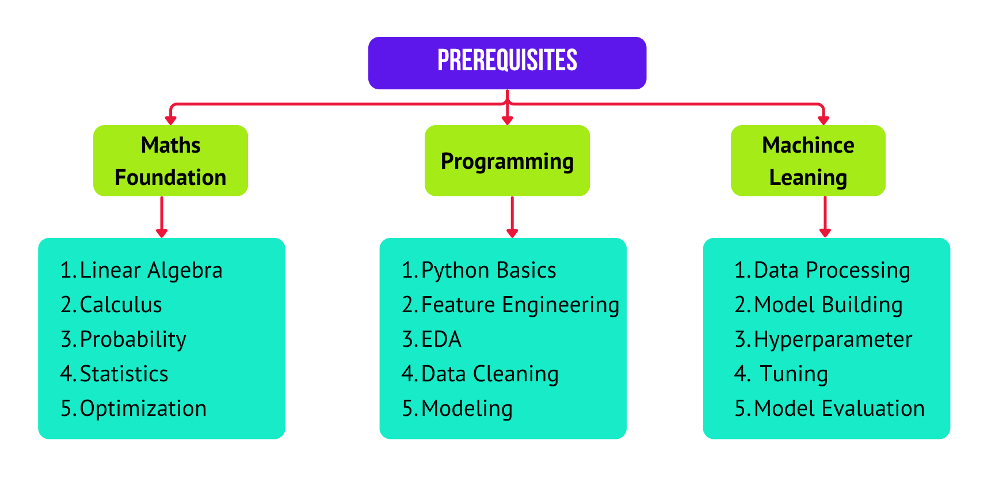
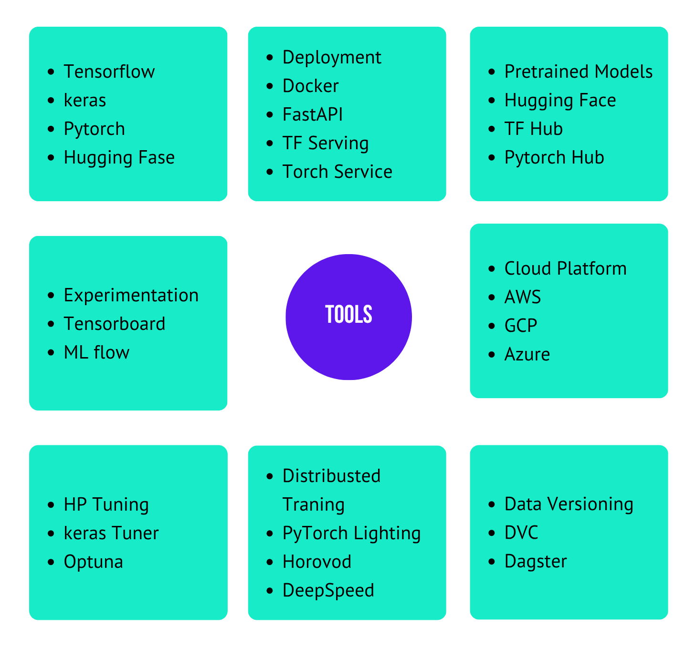

# Deep Learning Roadmap

## Roadmap

**Site**: https://rudra-g-23.github.io/100-days-of-deep-learning/

**Kaggle Code base**: https://www.kaggle.com/datasets/rudraprasadbhuyan/100-days-of-deep-learning-notes/code

---

## ANN

### History

- Roadmap I follow: 
  - https://youtu.be/XIcfwJUlXd0?si=Z4j3m91THVgmr_b2
- 100 days of deep learning announcement 	
  - https://youtu.be/2dH_qjc9mFg?si=3xYQJjsEYIFbMuN_
- What is deep learning? Dl vs ML	
  - https://youtu.be/fHF22Wxuyw4?si=RL3BryewKpOVPiDS
- Types of Neural Networks? History	
  - https://youtu.be/fne_UE7hDn0?si=GxGYBx47POr6plGX

### Perceptron

- What is Perceptron? Perceptron vs neuron	
  - https://youtu.be/X7iIKPoZ0Sw?si=w0wSbRXjGaS6Oqf7
  - https://www.kaggle.com/code/rudraprasadbhuyan/single-perceptron-demo
- Perceptron Trick 	
  - https://youtu.be/Lu2bruOHN6g?si=dR8pBDMZvNBNeAi0
  - https://www.kaggle.com/code/rudraprasadbhuyan/perceptron-trick-scratch
- Perceptron Loss function	
  - https://youtu.be/2_gCL5RAkHc?si=aX1ucWAW_LV99SuN
  - https://www.kaggle.com/code/rudraprasadbhuyan/perceptron-with-loss-function-scratch
- Problem with Perceptron	
  - https://youtu.be/Jp44b27VnOg?si=SxJFfA93OWMCrE6z
  - https://www.kaggle.com/code/rudraprasadbhuyan/perceptron-can-t-learn-xor-function
- MLP Notation	
  - https://youtu.be/H0_3SJh4Rqs?si=34wkP3KYnCfkxBzW
- MLP Intuition	
  - https://youtu.be/qw7wFGgNCSU?si=fs8KQ_nHFQGCIHjE

### Projects & Forward & Backward Propagation
- Forward Propagation	
  - https://youtu.be/7MuiScUkboE?si=WlsDN-IhC1QOp1Is
- Project: Customer Churn Prediction using ANN 
  - https://youtu.be/9wmImImmgcI?si=4jfbOMwc1XFOPiic
  - https://www.kaggle.com/code/rudraprasadbhuyan/starter-project-1-customer-churn-prediction
- Project: Handwritten digit classification using ANN
  - https://youtu.be/3xPT2Pk0Jds?si=kM440rt9qfsmnETh
  - https://www.kaggle.com/code/rudraprasadbhuyan/starter-project-2-handwritten-digit-classification
- Project: Graduate Admission Prediction using ANN
  - https://youtu.be/RCmiPBiA4qg?si=wRrUUwZ9gc2XkN6h
  - https://www.kaggle.com/code/rudraprasadbhuyan/starter-project-3-graduate-admission-prediction
- Loss Functions in DL	
  - https://youtu.be/gb5nm_3jBIo?si=JH2zZAYRFbMAUcJS
  - https://www.kaggle.com/code/rudraprasadbhuyan/perceptron-with-loss-function-scratch
- Backpropagation In DL | The What | P1	
  - https://youtu.be/6M1wWQmcUjQ?si=YblqCS67uLklSXN1
- backpropagation in DL | The How | P2	
  - https://youtu.be/6xO-x8y0YSY?si=mOPXxbvR5xLRKtXP
- Backpropagation in DL | The Why | P3	
  - https://youtu.be/6xO-x8y0YSY?si=ThNuWXb1IxEPRTk9

## Improving a Neural Network

### Gradient Descent

- MLP Memoization	
  - https://youtu.be/rW0eeTXas4k?si=2OV_KzeBN0ORqx8e
  - https://www.kaggle.com/code/rudraprasadbhuyan/mlp-memoization-in-deep-learning
- Gradient Descent In NN & It types	
  - https://youtu.be/7z6yXpYk7sw?si=nIWhBgwMA9DRwIGx
- Vanishing Gradient Problem in ANN	
  - https://youtu.be/uCrevbBh0zM?si=_r_gKiNfdydCg0lm
  - https://www.kaggle.com/code/rudraprasadbhuyan/vanishing-exploding-gradients-problem
- How to improve the performance of NN	
  - https://youtu.be/Ue_6n1yT_R8?si=Ezyz2enfaQailWGa

### Dropout &  Early Stopping

- Early Stopping 	
  - https://youtu.be/Ygvskt5HadI?si=O6hvzLvt69w-qaL_
- Simple Learning Rate Scheduler	
  - https://www.kaggle.com/code/rudraprasadbhuyan/simple-learning-rate-scheduler
- Learning Rate Scheduler in Keras	
  - https://www.kaggle.com/code/rudraprasadbhuyan/learning-rate-scheduler-keras
- Feature Scaling in NN	
  - https://youtu.be/mzRO0cVppQ0?si=SiSM29gQzkuQNYba
- Drop Out Layer Part-01	
  - https://youtu.be/gyTlcHVeBjM?si=9CuvIV0H8SEUqmDh
  - https://www.kaggle.com/code/rudraprasadbhuyan/dropout-in-regression
- Drop Out Layer  Code example Part-02	
  - https://youtu.be/tgIx04ML7-Y?si=o1NpptbdoPbE078C
  - https://www.kaggle.com/code/rudraprasadbhuyan/dropouts-in-classification
- Dropout in Classification	
  - https://www.kaggle.com/code/rudraprasadbhuyan/dropouts-in-classification

### Regularization & Activation Functions

- Regularization L2 , L1	
  - https://youtu.be/4xRonrhtkzc?si=KDJXBPrT1ahbC5y9
- Activation Function 	
  - https://youtu.be/7LcUkgzx3AY?si=rDwE2ky8pIFRsJc7
- ReLU Variants	
  - https://youtu.be/2OwWs7Hzr9g?si=hyvJZdRrSm-C8tYd
- Weight Initialization | What not to do | Part-01	
  - https://youtu.be/2MSY0HwH5Ss?si=T1ZNICMrsldCM9Xp
  - https://www.kaggle.com/code/rudraprasadbhuyan/zero-initialization-with-sigmoid
- Zero initialization With ReLU	
  - https://www.kaggle.com/code/rudraprasadbhuyan/zero-initialization-with-relu
- Weight Initialization Xavier/Gorat and He | Part-02	
  - https://youtu.be/nwVOSgcrbQI?si=HWfAPuFFb2PccqVe
- Batch Normalization	
  - https://youtu.be/2AscwXePInA?si=uQMVQB_AijsI12JH
  - https://www.kaggle.com/code/rudraprasadbhuyan/batch-normalization-in-keras

### Optimizers

- Optimizers Part-01	
  - https://youtu.be/iCTTnQJn50E?si=PAjyR17FKeZTzMUl
- Exponentially Weighted Moving Avg	
  - https://youtu.be/jAqVuYJ8TP8?si=ByqwKy0veNW-syiv
- SGD with Momentum Optimizers	
  - https://youtu.be/vVS4csXRlcQ?si=bfl-gvYexRbmnipC
- Nesterov Accelerated Gradient (NAG) optimizers	
  - https://youtu.be/rKG9E6rce1c?si=aiFDcjAQ0n5Td7qQ
- AdaGrad Optimizers	
  - https://youtu.be/nqL9xYmhEpg?si=fZfBEPgtmqhKu97o
- RMSProp Optimizers	
  - https://youtu.be/p0wSmKslWi0?si=vc5l16ysc48E9LZI
- Adam Optimizers	
  - https://youtu.be/N5AynalXD9g?si=8xQVt4-Flk_iLo_C
- Keras Tuner | Hyperparameter Tuning a NN	
  - https://youtu.be/oYnyNLj8RMA?si=h5tidHPF0Zto39iK

---

## CNN

### Basic

- What is CNN 	
  - https://youtu.be/hDVFXf74P-U?si=8Ijc2e60PTcczkfC
- CNN vs Visual Cortex	
  - https://youtu.be/aslTGS9ef98?si=vZL_a9o3oxDdKGPw
- Convolution Operation	
  - https://youtu.be/cgJx3GvQ5y8?si=_XF-yLjVJY6h-K39
- Padding & Strides in CNN	
  - https://youtu.be/btWE6SsdDZA?si=dyDFsa-_1Mvuk7Jx
- Pooling Operation	
  - https://youtu.be/DwmGefkowCU?si=21UnIyoDAYLXcA3n
- LeNet -5 Architecture	
  - https://youtu.be/ewsvsJQOuTI?si=o3is2ttG9N73t9Cw
- Comparing CNN vs ANN	
  - https://youtu.be/niE5DRKvD_E?si=3XCLvs-fGJlSYq0F

### Backpropagation

- Backpropagation in CNN | Part-01	
  - https://youtu.be/RvCCFttGFMY?si=fLGtiuuItjIr1KpK
- Backpropagation in CNN | Part-02	
  - https://youtu.be/OoSDzOodY3Y?si=tr2DtZ4HSftnmMtG
- Cat vs Dog Image Classification project	
  - https://youtu.be/0K4J_PTgysc?si=TeqjtFBXxWioERqE

### Augmentation, Pretrained Models, Filters, Transfer Learning
- Data Augmentation in CNN	
  - https://youtu.be/sM2C-SsREgM?si=8GrmYFBAhmPKH4gK
- Pretrained Models in CNN	
  - https://youtu.be/0MVXteg7TB4?si=7N1hi4ezrCusJSmA
- CNN Filters | Feature Maps	
  - https://youtu.be/WJysB1RK2vM?si=EWLNKz5onVMFJDwX
- Transfer Learning	
  - https://youtu.be/WWcgHjuKVqA?si=2uLpQpIEAxylTTx5
- Keras Functional Model	
  - https://youtu.be/OvQQP1QVru8?si=GkI3nwkKJ-sl9Cg8

---

## RNN

### Basic

- Why RNNs are needed
  - https://youtu.be/4KpRP-YUw6c?si=mHsGiaQNiJnsecDF
- RNN Forward Propagation	
  - https://youtu.be/BjWqCcbusMM?si=PJf-MgQ2O3Pw-l9X
- RNN Sentiment Analysis	
  - https://youtu.be/JgnbwKnHMZQ?si=A6TyIDJc2NPkMKHf
- Types of RNN	
  - https://youtu.be/TkOBxzhIySg?si=m3i09GuWZsvABkI_

### Backpropagation & Problems

- Backpropagation works in RNN	
  - https://youtu.be/OvCz1acvt-k?si=Q6htc0maasasEyKe
- Problems with RNN	
  - https://youtu.be/AWHSZzp96kM?si=sQvDx5uNMQi2J8EH

## LSTM, GRU & Bidirectional

- LSTM | Part 01	
  - https://youtu.be/z7IPBg6MyrU?si=lihuxciZ3AsbrYrC
- LSTM Architecture	
  - https://youtu.be/Akv3poqqwI4?si=dAzKP9H56K3WWZ-5
- LSTM Next word Predictor Project	
  - https://youtu.be/fiqo6uPCJVI?si=4tPMr04p1Y3-ceoC
- GRU	
  - https://youtu.be/QQfZAoNGQmE?si=kLVRguAdI4LQm5k7
- Deep RNNs Stacked RNNs, LSTMs, GRUs	
  - https://youtu.be/mlDkTrlLaio?si=7vAejB0nR2neTrur
- Bidirectional RNN, BiLSTM, BiGRU	
  - https://youtu.be/k2NSm3MNdYg?si=hwkdbNgQu4uF4FR0

---

## TRANSFORMERS

### Epic History of LLM's

- The Epic History of LLMs	
  - https://youtu.be/8fX3rOjTloc?si=anM12rYLFVIYXEXU

### Encoder & Decoder

- Encoder Decoder	
  - https://youtu.be/KiL74WsgxoA?si=cdNCfybKFd3AssZ5
- Attention Mechanism	
  - https://youtu.be/rj5V6q6-XUM?si=UFJbEnJNifPPbzPm
- Bahdanau vs Luong Attention	
  - https://youtu.be/0hZT4_fHfNQ?si=MuXCkIR2Qxqtn_D3
- Intro to Transformers | P01
  - https://youtu.be/BjRVS2wTtcA?si=W547Gw5zeOR7GSPm

### Self Attention

- What is Self Attention | P02	
  - https://youtu.be/XnGGmvpDLA0?si=1eCFc7YkSpZQ3YDm
- Self Attention in Transformers | P03
  - https://youtu.be/-tCKPl_8Xb8?si=zjUvQkKlytNc4-w9
- Scaled Dot-Product Attention
  - https://youtu.be/r7mAt0iVqwo?si=kLHbxqBrYYtAGZmU
- Self Attention Geometric Intuition 	
  - https://youtu.be/5ZgGuujZSbs?si=jJ4BkJRVZ9hMzpeX

### Multi Head Attention

- Why is Self Attention called “Self” ?	
  - https://youtu.be/o4ZVA0TuDRg?si=neLIsFQp_Lwyffqh
- Multi Head Attention	
  - https://youtu.be/bX2QwpjsmuA?si=4yfASvG0sl97pLC6
- Positional Encoding in Transformers	
  - https://youtu.be/GeoQBNNqIbM?si=EBJ1E-1Vug3BHMtu
- Layer Normalization in Transformers	
  - https://youtu.be/qti0QPdaelg?si=AJEpWjWPmmuQ-zYP

### Transformers Architecture
- Transformers Architecture	
  - https://youtu.be/Vs87qcdm8l0?si=YV5PtZLuDyrN_NKU
- Masked Self Attention	
  - https://youtu.be/m6onaKFzF94?si=MQc1Ai0ClG338fvY
- Cross Attention 	
  - https://youtu.be/smOnJtCevoU?si=RmcggcByHkyRhdYS
- Transformer Decoder Architecture	
  - https://youtu.be/DI2_hrAulYo?si=wX1HisWZusn3kEm6
- Transformer Inference
  - https://youtu.be/FtsMOzlwxws?si=s-k6BfZS59m7-TCu

---

## Perquisites

## Tools
